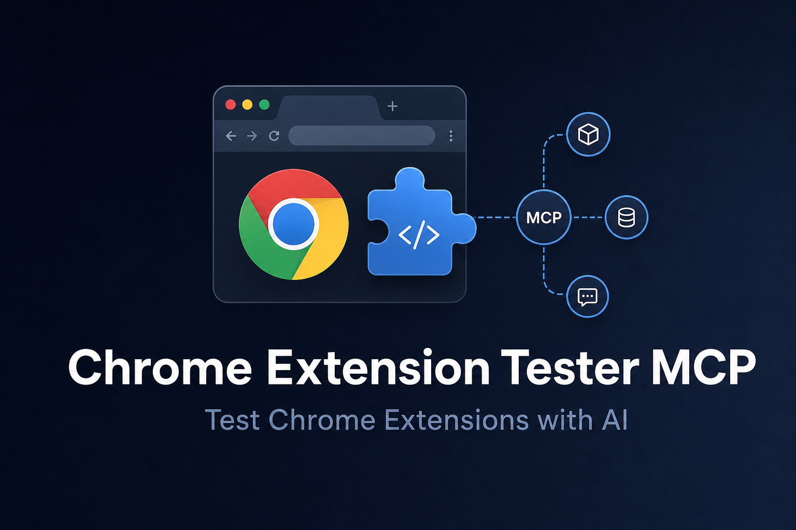

<p align="center">
  
</p>

<p align="center">
  <a href="https://opensource.org/licenses/MIT"></a>
  <a href="https://www.npmjs.com/package/chrome-extension-tester-mcp"></a>
  <a href="https://github.com/heyitschien/chrome-extension-tester-mcp/actions"></a>
  <a href="https://modelcontextprotocol.io"></a>
</p>

<h1 align="center">Chrome Extension Tester MCP</h1>

<p align="center">
  <strong>Give your AI assistant eyes and hands for Chrome Extension development.</strong><br />
  Launch a real browser, load your unpacked extension, capture screenshots, click UI, and read console logs — all through the <a href="https://modelcontextprotocol.io">Model Context Protocol</a>.
</p>

<p align="center">
  <a href="#recruiter-quick-scan">Recruiter Quick Scan</a> ·
  <a href="docs/SUPPORT-USE-CASE.md">Support Use Case</a> ·
  <a href="#-quick-start">Quick Start</a> ·
  <a href="#-ide-setup">IDE Setup</a> ·
  <a href="#-tools">Tools</a> ·
  <a href="#-for-ai-agents">For AI Agents</a> ·
  <a href="docs/recruiter-notes.md">Recruiter Notes</a> ·
  <a href="CONTRIBUTING.md">Contributing</a>
</p>

---

## What this is

This repo explores how browser-based workflows and Chrome extensions can be tested through structured automation, with an eye toward **AI-assisted QA and support workflows**.

An MCP (Model Context Protocol) server that gives AI assistants real browser control: launch Chromium with an unpacked extension, capture screenshots, click UI, and read console logs. Published on npm as [`chrome-extension-tester-mcp`](https://www.npmjs.com/package/chrome-extension-tester-mcp).

This is a **working open-source tool** and **concept demo** for repeatable test workflows — not an enterprise QA platform.

---

## Why it matters

Building and supporting Chrome extensions usually means manual reload-click-screenshot loops. Support and QA teams face the same friction when reproducing user issues. This project closes that loop so humans (or AI assistants) can verify, debug, and document extension behavior systematically.

---

## What it demonstrates

- Browser workflow testing with real Chromium + unpacked extensions
- MCP integration for AI-assisted development and QA
- Repeatable test workflows (launch → screenshot → logs → interact → close)
- Open-source dev tooling with CI, docs, and npm publishing
- QA thinking applied to extension development and support scenarios

---

## Recruiter quick scan

This project demonstrates:

- AI-assisted QA and automation workflow design
- Chrome extension testing without manual click-through
- MCP / structured tool integration for repeatable workflows
- Support-minded debugging (console logs, visual verification)
- Open-source documentation and developer experience
- Practical troubleshooting for extension developers and support teams

**Start here:** [docs/SUPPORT-USE-CASE.md](docs/SUPPORT-USE-CASE.md) (includes real screenshots + console logs) → [Quick Start](#-quick-start) → connect in Cursor → run the [example agent workflow](#example-agent-workflow)

For interview context, see [docs/recruiter-notes.md](docs/recruiter-notes.md).

<p align="center">
  
  &nbsp;&nbsp;
  
</p>
<p align="center"><em>Left: healthy popup evidence · Right: blank-popup support repro (synthetic)</em></p>

---

## Support / QA relevance

| Target role | What this repo proves |
| --- | --- |
| Technical Support | Symptom → repro → console logs → escalation note with evidence |
| QA | Repeatable screenshot + log capture instead of manual click-through |
| AI workflow operations | MCP tools as structured support instrumentation |
| Developer support | Extension-specific failure modes (CSP, MV3, packaging) |
| Product Support | Calm customer status updates while investigation runs |
| Implementation / Onboarding | First-install experience debugging and setup validation |

---

## Screenshots

Real execution captures from the MCP tool loop (regenerate with `npm run capture-evidence`):

| Capture | Link |
| --- | --- |
| Working popup | [`docs/screenshots/popup-working.png`](docs/screenshots/popup-working.png) |
| Blank popup repro | [`docs/screenshots/blank-popup-repro.png`](docs/screenshots/blank-popup-repro.png) |
| Browser session | [`docs/screenshots/working-browser-loaded.png`](docs/screenshots/working-browser-loaded.png) |
| Console logs | [`docs/evidence/`](docs/evidence/) |
| Support walkthrough | [`docs/SUPPORT-USE-CASE.md`](docs/SUPPORT-USE-CASE.md) |
| Workflow diagram | [`docs/assets/workflow.svg`](docs/assets/workflow.svg) |
| Demo fixtures | [`fixtures/`](fixtures/) |

---

## Notes on privacy / scope

| In scope (public) | Out of scope |
|---|---|
| MCP server source, npm package, examples | Private employer or customer extension code |
| Local testing on your own extensions | Claims of production QA team adoption |
| CI, contributing guides, issue templates | Credentials or internal support ticket data |

---

## Why this exists

Building Chrome Extensions with AI is painful when every change needs manual browser work:

1. Open `chrome://extensions` and click **Reload**
2. Re-open your popup or side panel
3. Click around to see if it works
4. Screenshot, paste into chat, describe the bug

**This MCP server closes that loop.** Your AI can build, launch, visually verify, and debug your extension without you acting as the clicker.

<p align="center">
  
</p>

---

## Features

| Capability | What it does |
|------------|--------------|
| **Real browser** | Headful Chromium with your unpacked MV2/MV3 extension loaded |
| **Visual verification** | Screenshots saved straight into your workspace |
| **Interaction** | Click elements via CSS selectors |
| **Debugging** | Unified console log stream from pages and scripts |
| **Zero config option** | Set `CHROME_EXTENSION_PATH` once, skip repeating paths |

---

## Tools

| Tool | Description |
|------|-------------|
| `launch_browser` | Start Chromium with your extension; optional URL and viewport size |
| `take_extension_screenshot` | Capture the active view to a file in your workspace |
| `click_element` | Click by CSS selector (e.g. `button#save`) |
| `get_browser_logs` | Return captured console output since launch |
| `close_browser` | End the session cleanly |

---

## Quick Start

### Prerequisites

- **Node.js 18+**
- A **built** extension folder containing `manifest.json` (e.g. `dist/`)

### Run instantly with `npx`

```bash
npx -y chrome-extension-tester-mcp
```

### Or install globally

```bash
npm install -g chrome-extension-tester-mcp
chrome-extension-tester-mcp
```

### Optional: default extension path

```bash
export CHROME_EXTENSION_PATH="/absolute/path/to/your/extension/dist"
```

---

## IDE Setup

### Cursor (recommended)

1. Open **Cursor Settings** → **Features** → **MCP**
2. Click **+ Add New MCP Server**
3. Use:

| Field | Value |
|-------|-------|
| **Name** | `chrome-extension-tester` |
| **Type** | `command` |
| **Command** | `npx` |
| **Args** | `-y`, `chrome-extension-tester-mcp` |

Or paste the ready-made config from [`examples/cursor-mcp.json`](examples/cursor-mcp.json).

<details>
<summary><strong>Claude Desktop</strong></summary>

Add to `~/Library/Application Support/Claude/claude_desktop_config.json` (macOS) or the equivalent on your OS:

```json
{
  "mcpServers": {
    "chrome-extension-tester": {
      "command": "npx",
      "args": ["-y", "chrome-extension-tester-mcp"],
      "env": {
        "CHROME_EXTENSION_PATH": "/absolute/path/to/your/extension/dist"
      }
    }
  }
}
```

See [`examples/claude-desktop-mcp.json`](examples/claude-desktop-mcp.json).

</details>

<details>
<summary><strong>VS Code (Cline, Roo Code, etc.)</strong></summary>

```json
{
  "mcpServers": {
    "chrome-extension-tester": {
      "command": "npx",
      "args": ["-y", "chrome-extension-tester-mcp"]
    }
  }
}
```

See [`examples/vscode-mcp.json`](examples/vscode-mcp.json).

</details>

---

## Example agent workflow

After the MCP server is connected, your AI can run a loop like this:

```
1. launch_browser  →  extensionPath: "dist", url: "https://example.com"
2. take_extension_screenshot  →  filename: "docs/screenshots/check.png"
3. get_browser_logs  →  inspect errors
4. click_element  →  selector: "#open-popup"
5. close_browser  →  when done
```

---

## For AI agents

If you are an AI assistant connected to this MCP server, follow this playbook:

**Visual changes (CSS, layout, popup UI)**

1. Apply code changes and build the extension.
2. Call `launch_browser` with `extensionPath` pointing at the build output (e.g. `dist/`).
3. Call `take_extension_screenshot` with a descriptive path under `docs/screenshots/`.
4. Inspect the image; iterate until the UI matches intent.

**Runtime errors**

1. Reproduce in the launched browser.
2. Call `get_browser_logs` and look for CSP violations, MV3 service worker errors, or message-passing failures.

**Always** call `close_browser` when finished to free resources.

---

## Development (from source)

```bash
git clone https://github.com/heyitschien/chrome-extension-tester-mcp.git
cd chrome-extension-tester-mcp
npm install
npm run build
node dist/index.js
```

For local MCP testing in Cursor, point the command at your build:

```json
{
  "command": "node",
  "args": ["/absolute/path/to/chrome-extension-tester-mcp/dist/index.js"]
}
```

---

## GitHub repository setup

When you publish or fork this repo, we recommend:

**Topics** (Settings → General → Topics):

`mcp`, `model-context-protocol`, `chrome-extension`, `playwright`, `cursor`, `ai`, `devtools`, `browser-automation`, `manifest-v3`

**Social preview**: upload `docs/assets/banner.png` under **Settings → General → Social preview**.

**Pinned README sections**: the banner and workflow diagram above are optimized for GitHub’s dark and light themes.

---

## Legal

- Licensed under the [MIT License](LICENSE).
- Uses [Playwright](https://playwright.dev/) (Apache 2.0) for browser automation.
- Chromium is downloaded by Playwright on first run; see [Playwright’s license terms](https://github.com/microsoft/playwright/blob/main/LICENSE).

---

## Contributing

We welcome issues and pull requests! Please read [CONTRIBUTING.md](CONTRIBUTING.md) and our [Code of Conduct](CODE_OF_CONDUCT.md) first.

Found a security issue? See [SECURITY.md](SECURITY.md) — please do **not** open a public issue.

---

## Author

**[@heyitschien](https://github.com/heyitschien)**

If this saves you time, consider starring the repo — it helps other developers find it.

<p align="center">
  <sub>Built for developers who ship Chrome Extensions with AI assistants.</sub>
</p>
