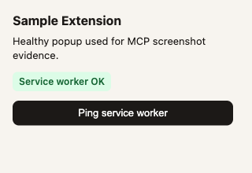
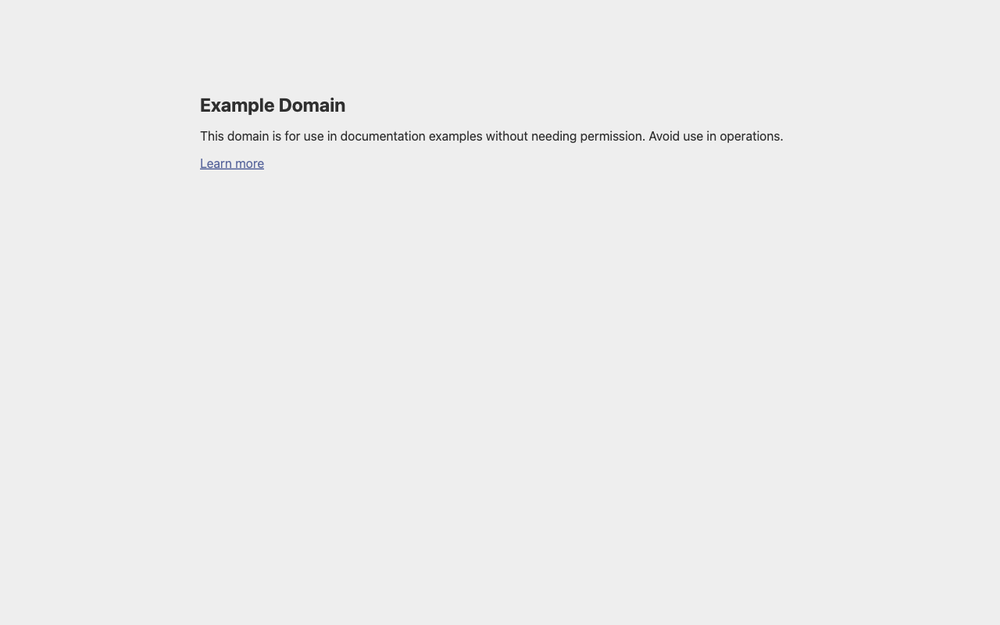

# Screenshots

Real captures from the MCP-equivalent Playwright loop:

```text
launch_browser → take_extension_screenshot → get_browser_logs → close_browser
```

Regenerate anytime:

```bash
npm run capture-evidence
```

## Gallery

| Artifact | What it shows |
| --- | --- |
|  | Healthy popup after ping — service worker OK |
|  | Synthetic blank popup (white screen) for support triage |
|  | Chromium session after `launch_browser` + navigate to example.com |

## Console evidence

| File | Scenario |
| --- | --- |
| [working-console.txt](../evidence/working-console.txt) | Healthy popup + ping response |
| [blank-popup-console.txt](../evidence/blank-popup-console.txt) | CSP / mount / service-worker style errors |
| [capture-summary.json](../evidence/capture-summary.json) | Capture metadata |

## Fixtures

- [fixtures/sample-extension-working](../../fixtures/sample-extension-working) — healthy UI
- [fixtures/sample-extension-blank-popup](../../fixtures/sample-extension-blank-popup) — intentional blank popup for SAMPLE-EXT-001

These fixtures are **synthetic demos** for documentation and local replay. They are not production Chrome Web Store extensions.
